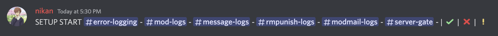

<h1>Ultimates</h1>

## 📚 Description

Ultimates is a discord moderation bot with lots of features.

-    Advanced logging system
-    Auto expire for punishments
-    Useful utility commands
-    Modmail system through the bot's direct messages
-    etc...

## Statatics

-    Language: [Typescript](https://www.typescriptlang.org/)
-    Database: [MongoDB](https://www.mongodb.com/)
-    Library: [Discord.Js](https://discord.js.org)

## 🛠 Development Team

-    [Nikan#8064](https://discord.com/users/757268659239518329)
-    [pogchampy#3412](https://discord.com/users/837306535813054464)

<h1>⚙️ How to setup?</h1>

## Step One:

Make a file called `.env` in your preject's main directory `(/.env)`. Paste the code below into the file and set the requirements.

```
TOKEN=your_client_token
MONGODB=your_mongoDB_connection_string
```

## Step Two:

Head over to `/src/json/config.json` to edit your own config.

• prefix: The prefix of legacy developer commands.

• owner: The ID of the owner of the bot.

• membeRoleId: The id of the member role in your server, only needed for verification.

• generalChannelId: The if of the main channel of your server, needed for `/lockdown` command.

## Step Three:

run `npm run setup` in your terminal, then follow as it says in your terminal and type `SETUP START [args]` in a channel the bot has access seeing it.

Format: first 6 arguments are channel mentions, and the 3 arguments at the end are emojis.

```

SETUP START [errors] - [mod-logs] - [message-logs] - [warn-remove-logs] - [modmail-logs] - [join-leaves-logs] - | [sucess] | [error] | [attention]

```



After you type this, the bot sends a code to you which you should paste in your `/src/json/database.json`.

-    Note: If you don't need the modmail/serverGateLogs feature(s), please still set them.

## Step Four:

-    Skip this step if you have the automod module disabled

Head over to `/src/config/automod.json` and edit your own configs in.

• enabledModules: Disabled/Enable automod modules which gets triggered.

• badwords: There are already some default bad words, if you want to add any, make sure it's in capitals.

• ignore: Set channel-names, category Ids, role Ids and permission for each automod module to ignore.

## Step Five:

-    Skip this step if you have the logging module disabled

Head over to `/src/config/logs.json` and edit your own configs in.

• enabledModules: Disabled/Enable logging modules which gets triggered.

• ignore: Set channel-ids, category Ids and role Ids for each logging module to ignore.

## Step Six:

Head over to `/src/config/moderation.json` and edit your own configs in.

• lengths: The length of automod and manual punishment Ids, and moderated nicknames.

• reason: The inbuilt reasons for each commands based of server rules.

